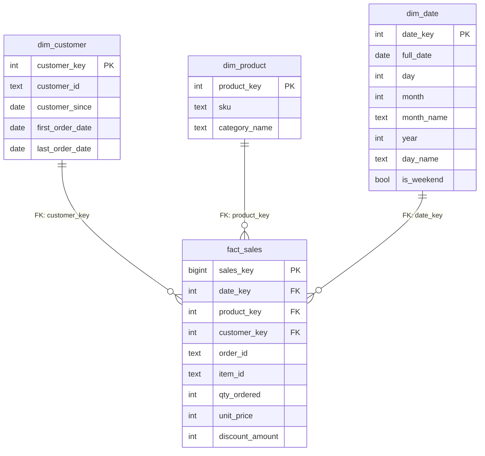

# E-Commerce Data Warehouse Pipeline

## 📌 Overview
This project implements an **end-to-end data warehouse pipeline** using a real-world e-commerce dataset (Pakistan Largest E-Commerce Dataset).

The pipeline transforms raw transactional CSV data into **business-ready marts** through a clearly defined and reproducible workflow stored in PostgreSQL.

The primary objective of this project is to demonstrate **data engineering fundamentals** including:
- deterministic batch processing
- layered data architecture (raw → staging → foundation → marts)
- dimensional modeling (fact & dimensions)
- idempotent and reproducible pipelines
- basic data quality validation
- SQL-driven transformations

This is **not a dashboard or BI project**, but a **pipeline-focused data engineering project**.

---

## 🧱 Architecture Overview
```text
CSV Source File
↓
Raw Layer
↓
Staging Layer
↓
Foundation Layer
↓
Marts Layer 
```

Each layer has clear responsibility boundaries and is executed as a separate pipeline step, orchestrated locally via `Makefile`.

---

## 📐 Dimensional Modeling (Foundation Layer)
The core of this pipeline is a Star Schema implemented in the Foundation Layer. This design optimizes the data for analytical queries by separating entities into Dimensions and transactions into a Fact table.



---

## 📂 Project Structure
```text
ecommerce-data-pipeline/
│
├── data/
│   ├── raw/
│   └── reports/
│
├── src/
│   ├── ingestion/
│   ├── staging/
│   ├── foundation/
│   ├── marts/
│   ├── qc/
│   └── utils/
│       ├── db.py
│       └── init_db.py
│
├── sql/
│   ├── ddl/
│   │   ├── raw/
│   │   ├── staging/
│   │   ├── foundation/
│   │   └── marts/
│   │
│   ├── load/
│   │   ├── staging/
│   │   ├── foundation/
│   │   │   ├── dim/
│   │   │   └── fact/
│   │   └── marts/
│   │
│   └── qc/
│       ├── qc_staging.sql
│       └── qc_foundation.sql
│
├── .env
├── Makefile
├── README.md
└── requirements.txt
```

---

## 🧱 Layer Responsibilities

### 1️⃣ Raw Layer
- Direct ingestion from CSV files
- Basic cleaning in pandas:
    - drop unnamed columns
    - normalize column names
- Stored as TEXT-typed columns
- Acts as a 1:1 copy of the source
- Primary input for staging

### 2️⃣ Staging Layer
- Converts TEXT columns into proper data types
- Applies standardization and formatting
- No business logic or aggregation

### 3️⃣ Foundation Layer
- Characteristics:
    - Contains dimension and fact tables
    - Fully rebuilt on every run
    - No history tracking
    - Deterministic and reproducible
- Foundation is not:
    - a BI consumption layer
    - a storage layer
    - a place for business aggregation

### 4️⃣ Marts Layer
- Business consumption layer.
- Characteristics:
    - Built only from foundation
    - Contains business-level aggregations and reshaping
    - No surrogate keys or foreign keys

All downstream marts must be built from foundation.

---

## 🔁 SCD Policy

All dimension tables use:

**Slowly Changing Dimension (SCD) Type 1**

Rationale:
- Single-batch data
- No historical requirements
- Avoids overengineering

Implications:
- Old values are overwritten
- No effective date tracking

---

## 🧪 Data Quality Policy

### Early Data Quality (Staging)
- Location: sql/qc/qc_staging.sql
- Nature: **non-blocking (warning only)**
- Purpose:
    - early validation
    - observability
- Output: CSV reports in data/reports/

### Final Data Quality (Foundation)
- Location: sql/qc/qc_foundation.sql
- Nature: **blocking (fail hard)**
- Purpose: guarantee foundation readiness
- Output: CSV reports in data/reports/
- Examples:
    - foreign key integrity
    - null critical fields
    - invalid measures
    - orphan records
If any check fails → pipeline stops.

---

## 🔄 Pipeline Workflow
```text
Initialize Database
→ Data Ingestion
→ Staging Load
→ Early Data Quality (warning)
→ Build Foundation
→ Final Data Quality (fail hard)
→ Build Marts
```

---

## 📊 Business Marts

Explicitly builds only three marts to avoid scope creep:

### 1️⃣ mart_sales_daily
- Grain: 1 row per date
- Purpose: daily sales performance monitoring

### 2️⃣ mart_product_performance
- Grain: 1 row per product
- Purpose: product & category performance analysis

### 3️⃣ mart_customer_summary
- Grain: 1 row per customer
- Purpose: customer value & behavior summary

Each mart has a clearly defined grain and is rebuilt deterministically.

---

## ▶️ How to Run the Pipeline

All pipeline steps are orchestrated using a `Makefile`.

Run individual steps:
```bash
make init-db
make ingest
make staging
make data-quality-checks-staging
make foundation
make final-data-quality-checks
make marts
```

Run the full pipeline:
```bash
make run-all
```

---

## 🛠️ Tech Stack

- Python
- Pandas
- SQL
- Makefile (local orchestration)

---

## 🎯 Design Philosophy

This pipeline prioritizes:

- Clarity over cleverness
- Deterministic over incremental
- Explicit decisions over implicit magic

Unnecessary complexity is intentionally avoided.

---

## 📌 Notes

This project is designed as a learning and portfolio project to demonstrate data engineering concepts in a clear and structured way.